# work_timeline


[rq](work_timeline.rq) [turtle/ttl](work_timeline.ttl)


## Use at 
 * https://query.wikidata.org/sparql

```sparql
#defaultView:Timeline
PREFIX wd: <http://wikidata.org/entity/>
PREFIX wdt: <http://www.wikidata.org/prop/direct/>
PREFIX p: <http://www.wikidata.org/prop/>
PREFIX pq: <http://www.wikidata.org/prop/qualifier/>
PREFIX ps: <http://www.wikidata.org/prop/statement/>

PREFIX target: <http://www.wikidata.org/entity/{{ q }}>

SELECT DISTINCT ?datetime ?description WHERE {
  {
    target: wdt:P577 ?datetime .
    BIND("🌞 publication date" AS ?description)
  }
  UNION 
  {
    target: wdt:P2507 / wdt:P577 ?datetime .
    BIND("❗ erratum" AS ?description)
  }
  UNION 
  {
    target: wdt:P5824 / wdt:P577 ?datetime .
    BIND("⛔ retracted" AS ?description)
  }
  UNION 
  {
    target: p:P793 ?event_statement .
    ?event_statement ps:P793 ?event_type .
    ?event_type rdfs:label ?description_ .
    ?event_statement pq:P585 ?datetime .
    FILTER (LANG(?description_) = "en")
    
    # Warning icon for retraction
    BIND(
      IF(
        ?event_type = wd:Q45203135,
        CONCAT("⛔ ", ?description_),
        IF(
          ?event_type = wd:Q56478588,
          CONCAT("❓ ", ?description_),
          ?description_
          )
        ) AS ?description)
  }
  UNION
  {
    SELECT ?datetime ?description WHERE {
      target: wdt:P2860 / wdt:P577 ?datetime
      BIND("📖➡️ cited work with earliest publication date" AS ?description)
    }
    ORDER BY ?datetime
    LIMIT 1
  }
  UNION
  {
    SELECT ?datetime ?description WHERE {
      target: wdt:P2860 / wdt:P577 ?datetime
      BIND("📖➡️ cited work with latest publication date" AS ?description)
    }
    ORDER BY DESC(?datetime)
    LIMIT 1
  }
  UNION
  {
    SELECT ?datetime ?description WHERE {
      target: ^wdt:P2860 / wdt:P577 ?datetime
      BIND("📖⬅️ citing work with earliest publication date" AS ?description)
    }
    ORDER BY ?datetime
    LIMIT 1
  }
  UNION
  {
    SELECT ?datetime ?description WHERE {
      target: ^wdt:P2860 / wdt:P577 ?datetime
      BIND("📖⬅️ citing work with latest publication date" AS ?description)
    }
    ORDER BY DESC(?datetime)
    LIMIT 1
  }
    UNION
  {
    target: (wdt:P747 | ^wdt:P629) / wdt:P577 ?datetime
    BIND("🌞 Publication of edition" AS ?description)
  }
}
```

```mermaid
graph TD
classDef projected fill:lightgreen;
classDef literal fill:orange;
classDef iri fill:yellow;
  v1("?datetime"):::projected 
  v6("?description"):::projected 
  v3("?description_")
  v4("?event_statement")
  v5("?event_type")
  a3((" "))
  a4((" "))
  a5((" "))
  a6((" "))
  a7((" "))
  a1((" "))
  a2((" "))
  c1([http://www.wikidata.org/entity/Q28942417]):::iri 
  subgraph union0[" Union "]
  subgraph union0l[" "]
    style union0l fill:#abf,stroke-dasharray: 3 3;
    subgraph union1[" Union "]
    subgraph union1l[" "]
      style union1l fill:#abf,stroke-dasharray: 3 3;
      subgraph union2[" Union "]
      subgraph union2l[" "]
        style union2l fill:#abf,stroke-dasharray: 3 3;
        subgraph union3[" Union "]
        subgraph union3l[" "]
          style union3l fill:#abf,stroke-dasharray: 3 3;
          subgraph union4[" Union "]
          subgraph union4l[" "]
            style union4l fill:#abf,stroke-dasharray: 3 3;
            subgraph union5[" Union "]
            subgraph union5l[" "]
              style union5l fill:#abf,stroke-dasharray: 3 3;
              subgraph union6[" Union "]
              subgraph union6l[" "]
                style union6l fill:#abf,stroke-dasharray: 3 3;
                subgraph union7[" Union "]
                subgraph union7l[" "]
                  style union7l fill:#abf,stroke-dasharray: 3 3;
                  subgraph union8[" Union "]
                  subgraph union8l[" "]
                    style union8l fill:#abf,stroke-dasharray: 3 3;
                    a7 --http://www.wikidata.org/prop/direct/P629-->  c1
                  end
                  subgraph union8r[" "]
                    style union8r fill:#abf,stroke-dasharray: 3 3;
                    c1 --http://www.wikidata.org/prop/direct/P747-->  a7
                  end
                  union8r <== or ==> union8l
                  end
                  a7 --http://www.wikidata.org/prop/direct/P577-->  v1
                  bind0[/"'🌞 Publication of edition'"/]
                  bind0 --as--o v6
                end
                subgraph union7r[" "]
                  style union7r fill:#abf,stroke-dasharray: 3 3;
                  a6 --http://www.wikidata.org/prop/direct/P2860-->  c1
                  a6 --http://www.wikidata.org/prop/direct/P577-->  v1
                  bind1[/"'📖⬅️ citing work with latest publication date'"/]
                  bind1 --as--o v6
                end
                union7r <== or ==> union7l
                end
              end
              subgraph union6r[" "]
                style union6r fill:#abf,stroke-dasharray: 3 3;
                a5 --http://www.wikidata.org/prop/direct/P2860-->  c1
                a5 --http://www.wikidata.org/prop/direct/P577-->  v1
                bind2[/"'📖⬅️ citing work with earliest publication date'"/]
                bind2 --as--o v6
              end
              union6r <== or ==> union6l
              end
            end
            subgraph union5r[" "]
              style union5r fill:#abf,stroke-dasharray: 3 3;
              c1 --http://www.wikidata.org/prop/direct/P2860-->  a4
              a4 --http://www.wikidata.org/prop/direct/P577-->  v1
              bind3[/"'📖➡️ cited work with latest publication date'"/]
              bind3 --as--o v6
            end
            union5r <== or ==> union5l
            end
          end
          subgraph union4r[" "]
            style union4r fill:#abf,stroke-dasharray: 3 3;
            c1 --http://www.wikidata.org/prop/direct/P2860-->  a3
            a3 --http://www.wikidata.org/prop/direct/P577-->  v1
            bind4[/"'📖➡️ cited work with earliest publication date'"/]
            bind4 --as--o v6
          end
          union4r <== or ==> union4l
          end
        end
        subgraph union3r[" "]
          style union3r fill:#abf,stroke-dasharray: 3 3;
          f5[["?description_ = 'en'"]]
          f5 --> v3
          c1 --http://www.wikidata.org/prop/P793-->  v4
          v4 --http://www.wikidata.org/prop/statement/P793-->  v5
          v5 --http://www.w3.org/2000/01/rdf-schema#label-->  v3
          v4 --http://www.wikidata.org/prop/qualifier/P585-->  v1
          bind6[/"if(?event_type = http://wikidata.org/entity/Q45203135,concat('⛔ ',?description_),if(?event_type = http://wikidata.org/entity/Q56478588,concat('❓ ',?description_),?description_))"/]
          v5 --o bind6
          v3 --o bind6
          bind6 --as--o v6
        end
        union3r <== or ==> union3l
        end
      end
      subgraph union2r[" "]
        style union2r fill:#abf,stroke-dasharray: 3 3;
        c1 --http://www.wikidata.org/prop/direct/P5824-->  a2
        a2 --http://www.wikidata.org/prop/direct/P577-->  v1
        bind7[/"'⛔ retracted'"/]
        bind7 --as--o v6
      end
      union2r <== or ==> union2l
      end
    end
    subgraph union1r[" "]
      style union1r fill:#abf,stroke-dasharray: 3 3;
      c1 --http://www.wikidata.org/prop/direct/P2507-->  a1
      a1 --http://www.wikidata.org/prop/direct/P577-->  v1
      bind8[/"'❗ erratum'"/]
      bind8 --as--o v6
    end
    union1r <== or ==> union1l
    end
  end
  subgraph union0r[" "]
    style union0r fill:#abf,stroke-dasharray: 3 3;
    c1 --http://www.wikidata.org/prop/direct/P577-->  v1
    bind9[/"'🌞 publication date'"/]
    bind9 --as--o v6
  end
  union0r <== or ==> union0l
  end
```


